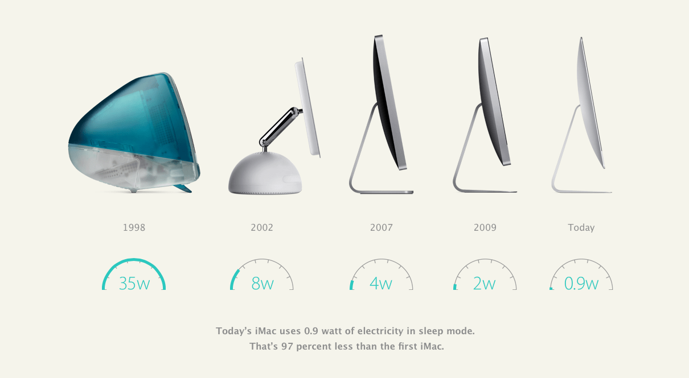

# Data Visualization

## Assignment 3: Data Visualization Ethics

### Requirements:
- Let's return to the data visualizations we evaluated for Assignment 2.  
- For each visualization:

### Good Visualization

    - Explain (with reference to material covered up to date, along with readings and other scholarly sources, as needed) whether or not you think this data visualization is accessible, reproducible, and equitable. 
        ```
        Your answer...

        * Accessible: It's accessible because the information is presented with clear images, making it easy to interpret the scale of the axes within a timeline domain.

        * Reproducible: The visualization does not appear to be reproducible, as it seems to have been developed in a non-programmatic way (no code is in the image).

        * Equitable: Although the visualization covers technological aspects, it ensures that all users, regardless of their backgrounds, abilities, or experiences, can access, interpret, and benefit from the information presented.

        ```
    - How could this data visualization have been improved (in terms of accessibility, reproducibility, equity)?  
        ```
        Your answer...

        * Accessibility: Accessibility can be enhanced by adjusting the graph text configuration, including color, size, font type, and placement. Additionally, adding a title to the visualization can help convey the complete message more effectively.

        * Reproducibility: Reproducibility can be enhanced by creating the image using code with tools like ggplot in R or matplotlib in Python.

        * Equity:  Equity can be improved by providing alternative text for images to assist users with visual impairments.

        ```


### Bad Visualization


    - Explain (with reference to material covered up to date, along with readings and other scholarly sources, as needed) whether or not you think this data visualization is accessible, reproducible, and equitable. 
        ```
        Your answer...

        * Accessible: It is not accessible because a large amount of text is packed into half of the visualization with minimal spacing, making it difficult to read. Additionally, the graph on the other half of the visualization has axes that are hard to identify due to unclear units or scale.

        * Reproducible: This visualization was created using Tableau Public; therefore, it is not reproducible.

        * Equitable: This visualization is not very equitable, as it contains barriers that prevent some audiences from accessing it. The design makes it complex to read and navigate, and the final message is unclear.

        ```
    - How could this data visualization have been improved (in terms of accessibility, reproducibility, equity)?  
        ```
        Your answer...

        * Accessibility: Accessibility can be improved by significantly reducing the amount of text, making it more concise, and using a larger font size with increased spacing. Additionally, for the graph, alternative descriptive text can be provided, and the axes can be enhanced with clearer labels and legends to make the graph easier to understand.

        * Reproducibility: Reproducibility can be enhanced by creating the image using code with tools like ggplot in R or matplotlib in Python.

        * Equity: Equity can be improved by completely redesigning the entire visualization, presenting it with more concise text, and improving its design to enhance accessibility, transparency, clarity, and inclusion.

        ```

- Word count should not exceed (as a maximum) 300 words for each visualization. 

### Why am I doing this assignment?:
- This ongoing assignment ensures active participation in the course, and assesses learning outcomes 2 and 3:  
* Apply general design principles to create accessible and equitable data visualizations
* Use data visualization to tell a story

### Rubric:
| Component               | Scoring   | Requirement                                                 |
|-------------------------|-----------|-------------------------------------------------------------|
| Data viz classification and justification | Complete/Incomplete | - Data viz are clearly classified as good or bad<br />- At least three reasons for each classification are provided<br />- Reasoning is supported by course content or scholarly sources |
| Suggested improvements  | Complete/Incomplete | - At least two suggestions for improvement<br />- Suggestions are supported by course content or scholarly sources |

## Submission Information

🚨 **Please review our [Assignment Submission Guide](https://github.com/UofT-DSI/onboarding/blob/main/onboarding_documents/submissions.md)** 🚨 for detailed instructions on how to format, branch, and submit your work. Following these guidelines is crucial for your submissions to be evaluated correctly.

### Submission Parameters:
* Submission Due Date: `HH:MM AM/PM - DD/MM/YYYY`
* The branch name for your repo should be: `assignment-3`
* What to submit for this assignment:
    * This markdown file (assignment_3.md) should be populated and should be the only change in your pull request.
* What the pull request link should look like for this assignment: `https://github.com/<your_github_username>/visualization/pull/<pr_id>`
    * Open a private window in your browser. Copy and paste the link to your pull request into the address bar. Make sure you can see your pull request properly. This helps the technical facilitator and learning support staff review your submission easily.

Checklist:
- [ ] Create a branch called `assignment-3`.
- [ ] Ensure that the repository is public.
- [ ] Review [the PR description guidelines](https://github.com/UofT-DSI/onboarding/blob/main/onboarding_documents/submissions.md#guidelines-for-pull-request-descriptions) and adhere to them.
- [ ] Verify that the link is accessible in a private browser window.

If you encounter any difficulties or have questions, please don't hesitate to reach out to our team via our Slack at `#cohort-3-help`. Our Technical Facilitators and Learning Support staff are here to help you navigate any challenges.
